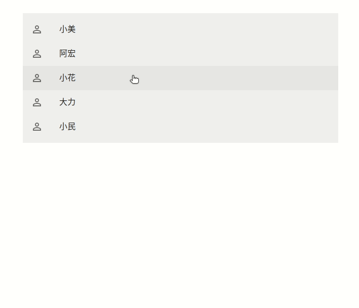

# 智齡科技小型專題

請做一個簡單的 List 呈現 Patients，並於點擊後跳出 Dialog 呈現該 Patient 的 Order(醫囑)，  
於 Dialog 右上增加可新增 Order 按鈕，並提供編輯回存功能。  

<https://docs.google.com/document/d/1E5frZ_bw80f163XclcMHwkyRZAzMs3ubEstNhlqh3kI/edit>

## service start and stop

需要能夠執行 bash, docker, docker-compose  
才能啟動服務  

docker image 如果失效, 文件下方有 docker build 用法  

```bash
# start service in container
bash project.sh -c

# stop service
bash project.sh -s

# website address
http://localhost:3001 
or 
```

## 使用技術

1 backend:  
golang gin gorm  
wire testtify go-playground  
ulid PostgreSQL

2 frontend:  
react Next.js axios  
MUI(material-ui)

## demo



## 雜談

1  
Backend project layout:  
主要依照 整潔架構分為四層  
rest, application, domain, infra

ioc 依賴注入 組合元件的邏輯  
util 無關 domain 商業, 可以和多個 project 共用的技術元件  
server.go 是程式進入點
```
./jubo-homework/backend$ tree -L 1
.
├── rest
├── application
├── domain
├── infra
├
├── ioc
├── util
├── configs
├
└── server.go
```
- - -
Frontend project layout:  
components 畫面邏輯  
services 呼叫 backend api  
./page/index.js 是網頁進入點
```
./jubo-homework/frontend$ tree -L 3
.
└── src
    ├── components
    │     ├── OrderDialog.js 
    │     └── PatientsList.js
    ├── pages
    │     └── index.js
    ├── services
    │     ├── ApiOrder.js
    │     └── ApiPatient.js
```

2  
把 config, env 加入到 git  
作業性質, 請見諒  

3  
變更了作業敘述中的資料結構

若資料庫 schema 採用原先的資料結構  
實現 order, patient 的 query list 功能  
比較麻煩

patient:order 的關係是 1:N  
所以我覺得  
應該讓 order 有 patient.id 比較合理

```
// 原本的
patients: 
{
  Id: “1”,
  Name: “小民”,
  OrderId: ‘1’,
}

orders: 
{
  Id: ‘1’,
  Message: ‘超過120請施打8u’,
}

- - -

// 修改後
patients: 
{
  "id": "01GWFC7ZXTG9ZH6GPXFKJM0PNT",
  "name": "小民"
}

orders: 
{
  "id": "01GWFCJQAY4QCSXJ1W1SF3ACJA",
  "message": "血壓略高，要按時吃藥",
  "patient_id": "01GWFC7ZXTG9ZH6GPXFKJM0PNT"
}
```

# Dockerfile

```bash
# backend
./jubo-homework$ docker build -f Dockerfile-backend -t x246libra/jubo-homework-backend:v1.0 . && \
    docker rmi `docker images --filter label=stage=builder -q`

# frontend
./jubo-homework$ npm --prefix ./frontend run build

./jubo-homework$ docker build -f Dockerfile-frontend -t x246libra/jubo-homework-frontend:v1.0 . && \
    docker rmi `docker images --filter label=stage=builder -q`
```

## backend api

```bash
curl -X GET --location "http://localhost:8888/v1/api/patients" \
-H "Accept: application/json"

curl -X GET --location "http://localhost:8888/v1/api/orders" \
-H "Accept: application/json"

curl -X GET --location "http://localhost:8888/v1/api/orders?patient_id=01GWFC9277K77PP1XX57BNHBFS" \
-H "Accept: application/json"

curl -X POST --location "http://localhost:8888/v1/api/orders" \
-H "Accept: application/json" \
-d '{ "message": "病人精神狀態不佳, 要注意睡眠", "patient_id": "01GWFC9277K77PP1XX57BNHBFS" }'

curl -X GET --location "http://localhost:8888/v1/api/orders/01GWFCJQAY4QCSXJ1W1SF3ACJG" \
-H "Accept: application/json"

curl -X PATCH --location "http://localhost:8888/v1/api/orders/01GWFCJQAY4QCSXJ1W1SF3ACJG" \
-H "Accept: application/json" \
-d '{ "message": "血糖超過120，建議施打 10 單位胰島素" }'

```